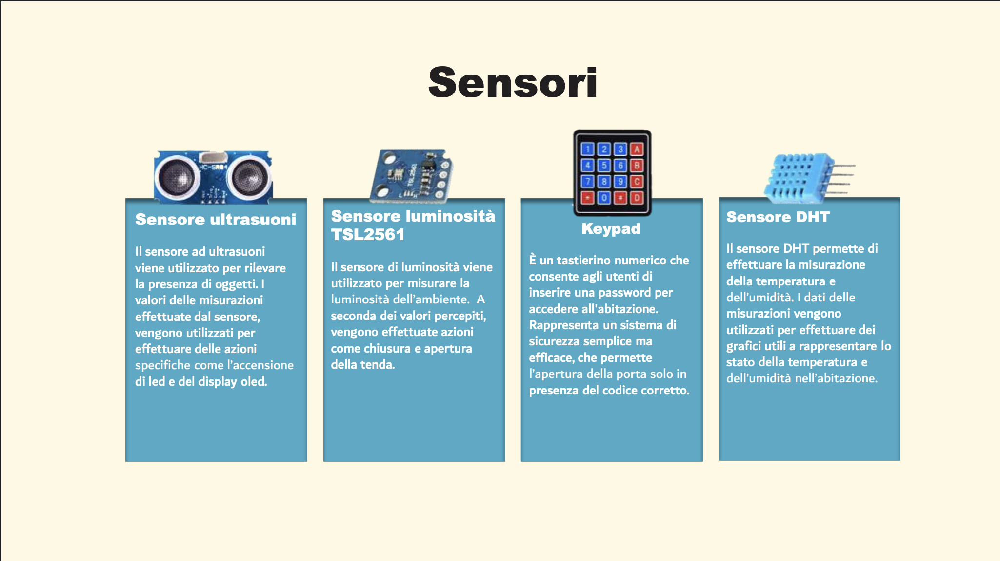
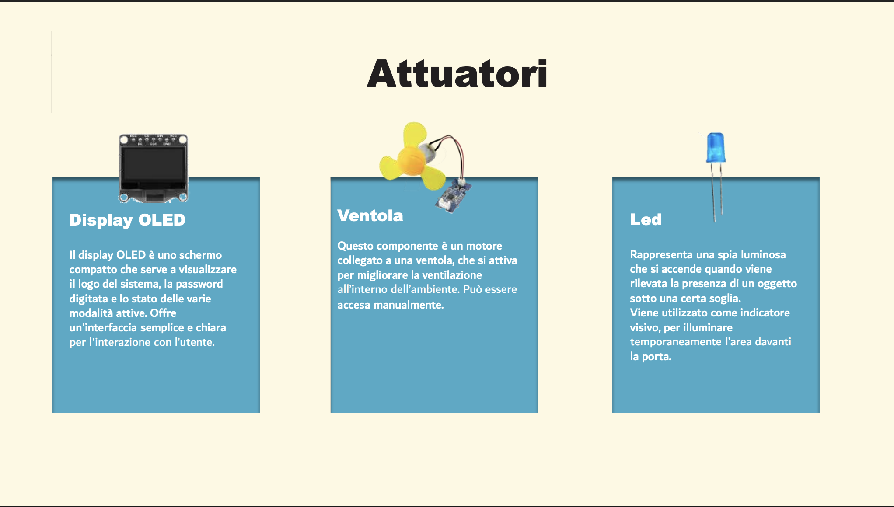
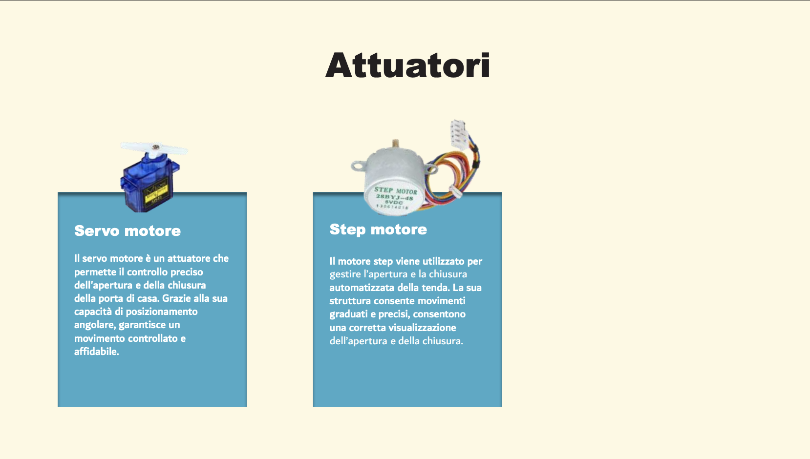
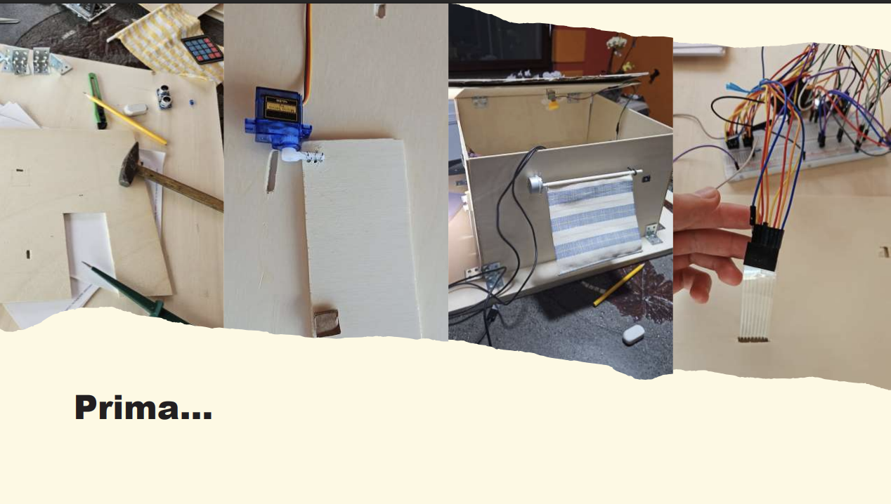
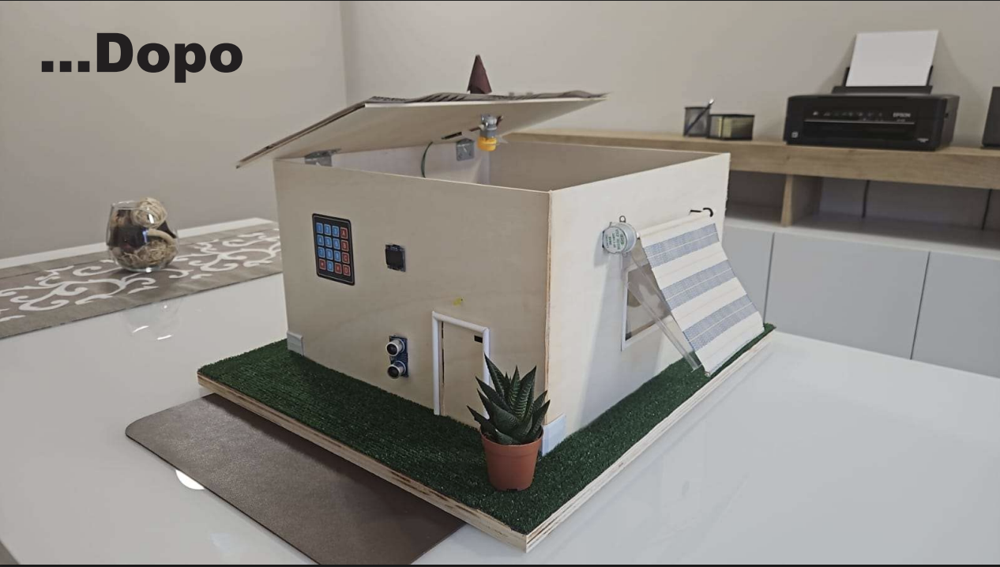

# LUMA - Smart Home IoT Project
**"More than a tent"**

## 📌 Descrizione del Progetto
**LUMA** è un progetto di Internet of Things (IoT) nato con l'intento di realizzare una smart home in grado di gestire in modo intelligente e automatizzato diverse funzionalità domestiche. Il cuore del sistema è la gestione delle **tende**, integrando sensori e dispositivi per migliorare il comfort e la sicurezza dell'abitazione.

Il sistema utilizza un'architettura basata su due schede **ESP32** connesse tramite protocollo **MQTT** e gestite tramite un'interfaccia **Node-RED**.

---

## 🔌 Hardware: Sensori e Attuatori
Il sistema LUMA si basa sull'interazione dinamica tra il mondo fisico e la logica digitale:
* **Sensori:** Rappresentano gli input che monitorano l'ambiente circostante.
* **Attuatori:** Sono i componenti che eseguono le azioni fisiche in risposta ai dati.

### 📡 Sensori (Input)
I sensori permettono al sistema di "sentire" i cambiamenti ambientali e di presenza.

* **Sensore Ultrasuoni:** Utilizzato per rilevare la presenza di oggetti e attivare LED o display.
* **Sensore Luminosità (TSL2561):** Misura la luce ambientale per gestire l'apertura/chiusura delle tende.
* **Sensore DHT:** Effettua la misurazione in tempo reale di temperatura e umidità.
* **Keypad:** Tastierino numerico per l'inserimento di una password di sicurezza a 4 cifre.

### ⚙️ Attuatori (Output)
Gli attuatori eseguono i comandi per regolare l'ambiente domestico.

* **Step Motor (28BYJ-48):** Gestisce l'apertura e la chiusura automatizzata e precisa della tenda.
* **Servo Motore:** Permette il controllo preciso dell'apertura e della chiusura della porta d'ingresso.
* **Display OLED:** Schermo compatto per visualizzare loghi, password digitata e stati del sistema.
* **Ventola:** Motore per il rinfrescamento dell'ambiente, attivabile manualmente.
* **Led:** Indicatori visivi che illuminano l'area d'ingresso al rilevamento di presenza.

---

## 🏗️ Evoluzione del Progetto
Lo sviluppo di LUMA ha portato il sistema da una fase di prototipazione dei componenti su breadboard alla completa integrazione in un modello abitativo in scala.

| Fase di Sviluppo (Prima) | Risultato Finale (Dopo) |
| :---: | :---: |
|  |  |

---

## 🚀 Funzionalità e Connettività
L'utilizzo di **MQTT** è fondamentale per la connessione tra le ESP32 e per il monitoraggio dei dati tramite dashboard.

### Gestione Tenda
* **Manuale:** Controllo diretto tramite interfaccia Node-RED.
* **ClockMode:** Gestione automatica secondo orari impostati dall'utente.
* **TempMode:** Regolazione in funzione della temperatura interna.
* **LightMode:** Apertura o chiusura in base all'intensità della luce rilevata.

### Sicurezza e Comfort
* **Accesso sicuro:** Apertura della porta tramite password sul keypad o via dashboard.
* **VentMode:** Modalità manuale per attivare la ventilazione dell'ambiente.
* **Monitoraggio:** Grafici dinamici su Node-RED per temperatura, umidità e percentuale di apertura della tenda.

---

## 👥 Gruppo di Sviluppo (Gruppo 1)
* Apicella Francesco
* Autorino Luigi
* Chirico Emanuel
